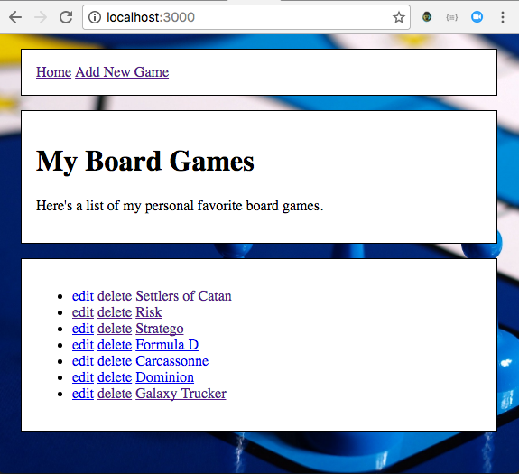

# Cruddy Board Games
This app stores a list of a board game names and their descriptions in an array
of objects in a local JSON file. The website supports basic CRUD operations
(create, read, update and delete) through a RESTful interface using HTTP methods
(GET, POST, PUT, DELETE).

HTML forms do not support HTTP methods PUT and DELETE, so jQuery is used to
intercept user interactions when someone tries to submit an edit form or clicks
on a delete link. jQuery uses .preventDefault() to halt the normal action and
creates an AJAX request instead.

## Installation
1. Download the repo.
2. use 'npm install' to install dependencies
3. run `nodemon` to start the server
4. visit the page running at <http://localhost:3000>

## Full RESTful Routing

<table>
<thead>
<tr>
<th>Verb</th>
<th>Path</th>
<th>Action</th>
<th>Used for</th>
</tr>
</thead>
<tbody>
<tr>
<td>GET</td>
<td>/games</td>
<td>index</td>
<td>display a list of all games</td>
</tr>
<tr>
<td>GET</td>
<td>/games/new</td>
<td>new</td>
<td>return an HTML form for creating a new game</td>
</tr>
<tr>
<td>POST</td>
<td>/games</td>
<td>create</td>
<td>create a new game (using form data from /games/new)</td>
</tr>
<tr>
<td>GET</td>
<td>/games/:name</td>
<td>show</td>
<td>display a specific game</td>
</tr>
<tr>
<td>GET</td>
<td>/games/:name/edit</td>
<td>edit</td>
<td>return an HTML form for editing a game</td>
</tr>
<tr>
<td>PUT</td>
<td>/games/:name</td>
<td>update</td>
<td>update a specific game (using form data from /games/:name/edit)</td>
</tr>
<tr>
<td>DELETE</td>
<td>/games/:name</td>
<td>destroy</td>
<td>deletes a specific game</td>
</tr>
</tbody>
</table>

## Licensing
All content is licensed under a CC­BY­NC­SA 4.0 license.
All software code is licensed under GNU GPLv3. For commercial use or alternative licensing, please contact legal@ga.co.

