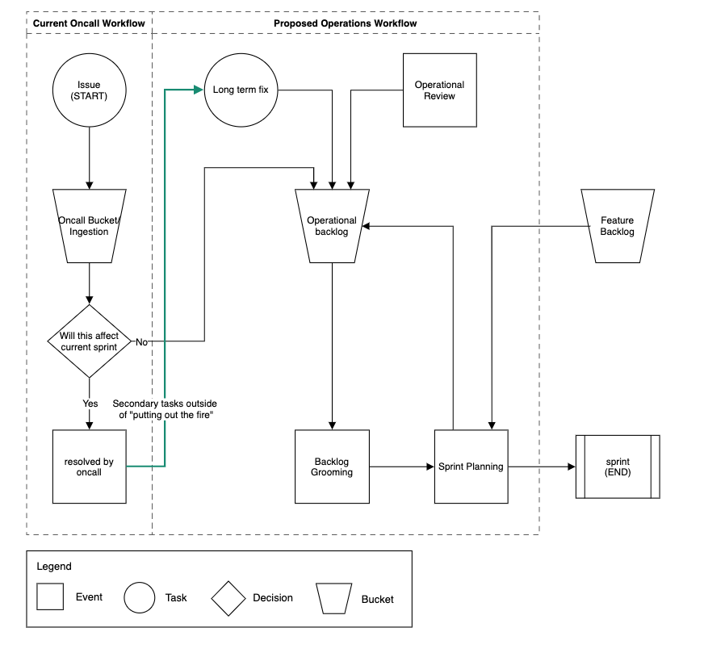

# Overview
This proposal is to address ambiguities in the team's operation procedures and to design a clear and standard process for all team member's oncall rotation as introduce a new procedure to process operational tech debt. This document lays out process suggestions that the team may adopt to be cognitive in the subjects of - monitoring/alerting, security posture, and oncall processes. The scope of this proposal affects the team and is intended to be reviewed and suited to the team's needs before implementation.

# Background
The  operational tasks (those that fall outside feature work that keeps the supported apps/services/infrastructure/security working smoothly) are not well marked and have historically been reactive. This often leads to oncall shifts that aren't clearly defined. Some weeks can be slow and others can be poppin' - the pace week to week, depends on CSR issues from slack channel or the automated vulnerabilities/security compliance tickets. In an attempt to improve the team's operational process, the following topics will be addressed:

* There is no formal oncall handoff process, there is a variation in handoff styles between different team members and results in unpredictable handoff and ticket notes.
* Oncall priorities can be ambiguous at times and the oncall tends to default to feature work.
* Oncall tends to implement the quick solution that resolves a an immediate issue. Sometimes there's a long-term solution that could be implemented but may not be recorded and gets forgotten.
* Oncall tasks are indiscernible from feature work in the backlog.
* Longer tasks have a tendency to be forgotten and left in the operations sprint in any given user's lane, leading to tasks that can be left undone for some time.
* The team does not adequately account for operational epics (Prisma compliance, Infrastructure issues) in our backlog grooming or sprint planning.

# High-level Requirements
* Define to oncall responsibilities, priorities, and expectations.
* Structure an Oncall Handoff Process.
* Define the difference between an immediate oncall tasks from one that can go into the backlog.
* Structure Operational meetings (maybe piggyback off backlog grooming?) (determine how often, sprint-ly?).
* Account for Operations Backlog.
* Dedicate sprint time to operational tasks (i.e. operations tasks are not strictly oncall tasks).

# Project Proposal
This section is broken up into two subsections:
* Oncall Remodel
* Operations Program

## Part 1 - Oncall Remodel
The primary goal of the oncall should "protect the sprint" and enable the other members to work on their sprint items uninterrupted. The team has done this well and the following section is to introduce a standardization into maintaining this process and detail the team's expectations of the oncall.

### Definition of an Oncall task
* An unexpected task that has a high priority that supersedes the normal backlog grooming/sprint planning workflow. It is a task that needs to be addressed immediately.
* unordered examples:
  * supported slack channel requests (#concur_open, #ask_aviary, etc)
  * CIM team requests (with discretion)
  * vulnerability tickets
* It should be a task that can comfortably be done within one oncall rotation (ideally <= 3 story points).
* Exceptions:
* a big task that requires multiple members to address (such as a service interruption). This would constitute a all-hands on deck:
  * IE - connection to a dependent service breaks (like concur's auth service) and there's no immediate answer to why, multiple members should be brought in to address this situation (1member can triage the issue, while another can reach out to the auth team, etc).
* The oncall should be empowered to make a judgement call, especially if it is off-hours and they're unfamiliar with a given service to ask for assistance.
* Audience participation - Please give me incidents that you made a judgement call of not calling additional help and you wished you did it the other way around.

### Prioritization of Oncall tasks
I had difficulty thinking about this list so hoping that this can be a discussion.

* Service Interruption
* Security Compliance
* Customer Facing issues
* Operational Backlog items

There are times when the oncall may be approached to do a task, it is important the oncall feel empowered, if the task does not seem urgent, to request the user create a ticket to be referred to the ingestion queue. If there is ambiguity, may the oncall feel empowered to ask team members or the development manager to assist.

### Oncall Todo When not Addressing
A burdensome task that has affected team members during their oncall shift is, "what do I do now". The oncall sprint runs longer than the formal sprint and is not maintained. In the past, the oncall would, without clear goals, had opportunity to do either operational or feature work. Oncall should ideally be working on operational tasks when not addressing an immediate incident.

It is proposed that if an oncall is not managing an immediate problem that they pursue work on an operational task or break down a larger operational epic into manageable pieces (ie - creating Jira tickets our of prisma alerts or gathering info on a newrelic alarm).

### Oncall Handoff
The team has been without a standardized handoff process. This leads to items staying in one member's lane for several weeks. This proposed process is intended to ensure that issues are not lost within one member's lane and issue's assignees are up-to-date. Ideally, this ensures that tasks don't follow an outgoing oncall and they can essentially "wipe their memory" of oncall work and focus on their sprint items.

~ 5-10mins should be dedicated during the first standup between oncall shifts to discuss handoff notes. Ideally there should be ~1-2 tickets to discuss during this handoff time.

* Oncall tasks will no longer be assigned to individuals, and should be instead kept at the default or a dedicated "team-oncall-user". This is to facilitate awareness of board state as issues would previously stagnate in a user's lane.
* The handoff should be witnessed by the team to understand what is on the oncall's plate.
* The outgoing oncall should have all notes already commented on the working tickets.
* The outgoing oncall should use this time to give high-level of what they're handing off.
* The incoming oncall should use this time to review the notes and ask follow-up questions to ensure they understand what they might be in for.
* The incoming oncall should clarify their understanding of the priority of tickets in they'll be accepting.
* Any questions/answers should be added to the ticket so we don't lose information in tribal knowledge.

### Oncall Runbooks
This section is to define a standard operating procedure so if one is paged and they're unsure what to do, they can refer to these procedures. Additionally, these runbooks can act as an accumulation of knowledge as oncall shifts discover useful tricks or have additional tips (that one service with the unique thing you don't expect to have to account for).

The team wiki already contains an "Operations" section, so it may require some tidying. We can house a general oncall runbook as well as branch to service-specific runbooks should the need arise. Some things that are worth tracking in these runbooks are:

* NewRelic service page
* NewRelic alarm policies
* NewRelic Dashboards
* CloudWatch alarms page
* AUDIENCE PARTICIPATION SECTION

The goal here is that should X-service go down, there is documentation to address things that may be a cause or should it be a new situation, document it and the solution in the runbooks, account for it in the community wiki.

### Oncall Spinoff tasks
Oncall tasks tend to be fires that require immediate addressing. This often means a quick patch that might be imperfect or janky but has an opportunity for refinement. we implement the former but never get to the latter for a whatever reasons. This section is intended to address this discrepancy so we have a process to patch an issue, but also ensure follow-through to an ideal solution.

Tasks should be accounted as Jira tickets.
In the event of a short & long-term solution, tickets should be link to retain context when encountering a long-term ticket in a grooming session.

### Oncall Sample
* Monday standup (typical day):
  * outgoing oncall gives handoff notes.
  * there's one remaining task in the oncall - resolving a customer issue, `In Progress` lane.
  * incoming oncall reads the notes and is unclear if they're waiting on the customer or the customer is waiting for a reply, this can be briefly discussed and the ticket comments are updated.
* Day continues and the task is completed.
  * The issue was a customer issue that was not addressed in the public FAQ page. Oncall adds note about the issue in the FAQ page.
* What to work on now?
  * There are no high priority tickets in the backlog.
  * The oncall doesn't want to work on any of the listed tickets in the backlog
* Oncall Decides to review prisma site and see if they can investigate any alerts
  * creates a new ticket and tags it with operational label and moves it into the operational sprint.
* While working on the investigation - an alert is raised that requires the oncall's immediate attention.
  * Oncall can report issue to slack oncall channel.
    * This alerts the team to an issue and facilitates cooperation if a member knows where to point the oncall to more quickly resolve an issue.
* Oncall reviews newrelic/dashboard/runbook/etc & resolves the issue.
* A new undocumented procedure was required to resolve the issue.
* runbooks are updated to reflect the resolution steps.
* Oncall creates a ticket about the issue and give high level info regarding the issue and link to the runbook section that resolved the issue.

## Part 2 - Operational Program
This section of the proposal is intended to balance out the team's sprint priorities, where in the past sprint primarily focused on feature work (meat & potatoes) it neglected operational tasks (vegetables) and has no system in place to account for and address these ticket types. The section is broken into two sections, 1 - Introduction a new meeting to regularly discuss the team's operations workload and 2- Differentiation of operational & feature tickets and grooming the backlog.

### Operational Lead Role
This role is as the title suggests, a position of authority on operational topics - at the time of this proposal this covers driving operational meetings.

#### Term of Office
Under the Team Operations Expansion Proposal, 2021, the term of this appointment may last for a maximum of one (1) quarter. The position will be assigned via calendar scheduling that should be setup in advance so that every member of the team have an opportunity to hold office before the original office holder returns to the position. Really the goal of this term limit is that everyone can get experience doing this type of work yet give the position enough time to get comfortable with the responsibilities

#### Expectations
* Prepare topics of discussion for operational review meetings (expanded upon in operational review meetings section).
  * Review oncall wiki page, Holy Cowabunga's Oncall Scandals & Gossip [working title] - a page where oncall may not necessarily have an associated ticket but want to notate an issue.
  * Cursory look at service newrelic/cloudwatch pages and develop an itinerary.
* Lead operational review meeting and operational backlog grooming meeting.

### Operational Epics
The team has larger epic-level operational tasks that are captured as Jira tickets. These tasks tend to be things the team is aware of but don't have a strategy/system to proactively process the issues. The aim in addressing these issues proactively is to allow time planning before execution as opposed to racing against the deadline when it becomes a vulnerability tickets.

### Operational Review Meetings
These meetings are intended to be used for self-reflection and discussion on what we're doing right and what we can improve on operationally. Ideally, these meetings occur regularly outside of existing meetings (1x a month?). There will be a new unofficial team role to accompany these meetings, Operational Lead. The following are initial ideas to discussed and can be expanded/contracted as the team sees fit:

* The operational lead
* recurring issues, what may be causing them, and are there any opportunities we can take to alleviate them.
  * what task have we been repeatedly solving
  * opportunity to automate?
  * how are we being alerted to these tasks, are customers telling us and do we need to add automated alerting.
    * example - can we get a report of failed (subscription, etc.) emails to who and why
  * for stuff we don't have an immediate answer for (containers failing w/o reason)
    * keep a tracking ticket and note down everything we can from the event? maybe we can form a picture of why after aggregating this data???
* review the team's monitoring/alerting and discuss if it's working or maybe requires tweaking.
  * are there uncaught errors?
    * are these errors something we should care about?
    * does it require a code change?
* If there was a new/interesting task, it may be a good time for the team to review the oncall's process
  * did they follow procedure?
  * did they do something new that can be incorporated into the procedures?
* Review and develop our DevOps. Is there a process that isn't working well and should be reevaluated? Do we need to create an investigate task?
  * This may work well as a wiki page.
  * that anyone can view/update and the team can review this page together and discuss proper during the review meeting.
  * Is ECS/Chalice working for us?
  * Is are pipeline implementation working for us?
  * Do we need to adjust the way we're using CloudFormation(CF)/ Do we need to utilize a CF management framework (Terraform/SAM)?
  * Do we need to reassess unit tests? how about integration tests, end-to-end-test? Will we finally write up that test-in-prod script to automate that process & checking??!
* Should this time be used to discuss anything else?

### Operations Backlog Grooming
This meeting will also be run by the Operational Lead. The current backlog grooming can be maintained with a tweak - it will formally be divided into a feature and operations section and managed separately. In order to track feature and operations work separately, it is recommended the team adopt a ticket tagging system. This tagging system is discussed in the below section. This grooming time may also be spent to review & discuss operational EPICs and create tickets that will be addressed in the coming sprint. I.E. what do we think we'll be challenged for next, what can we do better.

### Introduce Label Criteria for Jira Tickets
In order to track and measure the team's endeavors between feature and operational work we'll be introducing a new process in our Jira ticket handling. Using Jira's label field, the team will establish labels between our feature and operational work. The labels will facilitate the following:

* divide the backlog into feature and operational tasks.
* metrics & tracking on team output. This can likely take a form of a Jira widget using JQL.
  * JQL rough draft - project = '<TEAM_NAME>', label = 'operations', date <= '<ARBITRARY_PERIOD_OF_TIME>'
Operations Flow Chart
Here is a flowchart of the intended workflow of this proposal.

# Operations Flowchart

